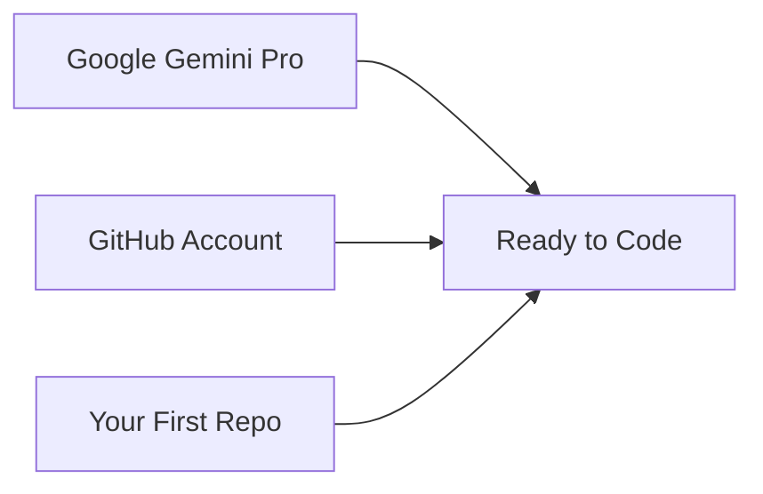

# Module 1: Getting Started

In this module you'll set up the three foundational accounts and tools you need for the rest of the workshop.

## What We're Setting Up

| Step | What | Why |
|------|------|-----|
| 1a | [Gemini Pro Student Login](01a-gemini-login.md) | Free AI coding assistant |
| 1b | [GitHub Account](01b-github-setup.md) | Version control & collaboration |
| 1c | [Your First Repo](01c-first-repo.md) | A place for your code to live |

!!! info "Already have these?"
    If you already have a GitHub account and Gemini access, skip ahead to [Module 2: Terminal Basics](02-terminal-basics.md) or [Module 3: Gemini CLI](03a-gemini-cli-install.md).
