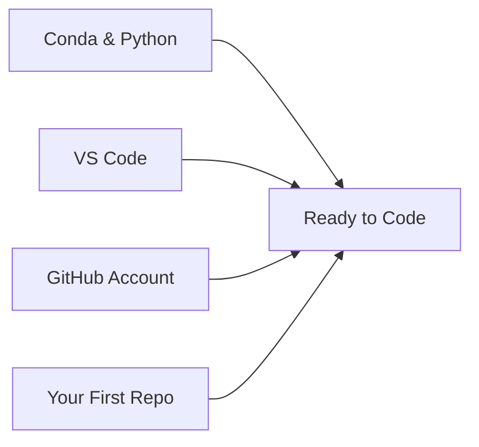

# Setup Overview

In this section you'll install the foundational tools and create the accounts you need for the rest of the workshop.

## What We're Setting Up

| Step | What | Why |
|------|------|-----|
| 1 | [Conda & Python](00a-conda-python.md) | Package/environment manager + Python |
| 2 | [VS Code](00b-vscode.md) | Code editor with built-in terminal & Git |
| 3 | [GitHub Account](01b-github-setup.md) | Version control & collaboration |
| 4 | [Your First Repo](01c-first-repo.md) | A place for your code to live |

!!! info "Already have these?"
    If you already have Python, a code editor, and a GitHub account, skip ahead to [Terminal Basics](02-terminal-basics.md) or [Gemini CLI](03a-gemini-cli-install.md).
